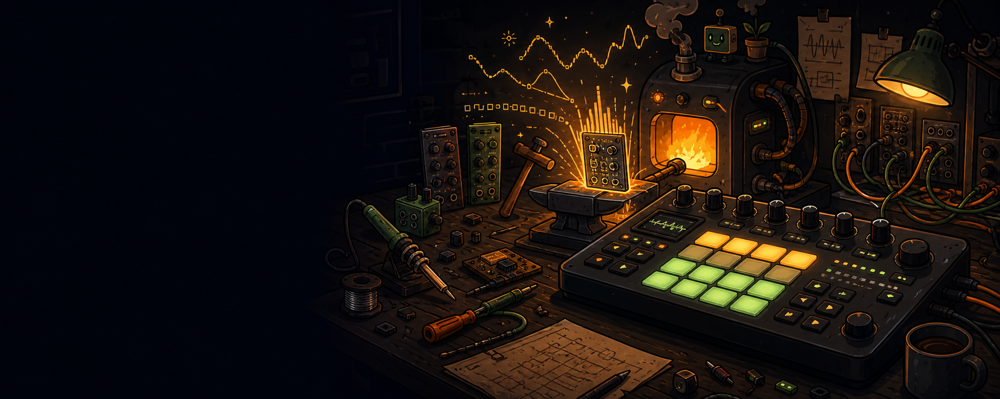

# Moveforge



Local development harness for building custom Schwung modules for Ableton Move.

Each module compiles to a `dsp.so` (aarch64 Linux for the device) and a `web/wasm/<id>.wasm` (browser, via Emscripten) from the same DSP source. The browser audio path uses the same int16 conversion as Move, so what you hear locally is what plays on device.

Schwung is unofficial and not supported by Ableton. Treat device deployment as experimental and keep backups of Move sets/samples.

## Included Modules

See [MODULES.md](MODULES.md) for the module index grouped by component type.

| id | kind | authoring | notes |
|---|---|---|---|
| `swarf` | sound_generator | plain C | Six note-mapped percussion voices sharing one engine; the only multi-group module (8 levels, 62 params) |
| `ballast` | sound_generator | plain C | Kick/tom/sub from one low-end voice: two-stage pitch envelope, click and grain layers, five drive curves |
| `westfold` | sound_generator | plain C | West Coast voice: dual oscillator FM, snap-assisted ratio, wavefolder, low-pass gate, tone, width |
| `dustline` | sound_generator | plain C | Subtractive/noise voice: oscillator blend, resonant filter, drive |
| `faust_voice` | sound_generator | Faust | Mono sawtooth + ADSR + resonant LPF + tanh — reference Faust voice |
| `trail` | audio_fx | Faust | Lush stereo delay: tempo-syncable, modulated, filtered/saturated feedback, ping-pong width, reverb tail |
| `filter` | audio_fx | Faust | Stereo state-variable filter morphing lowpass → bandpass → highpass on one recursion |
| `vca` | audio_fx | plain C | Note-gated ADSR amplifier: gives a chain an amp envelope its Source has not got |
| `faust_drive` | audio_fx | Faust | Stereo drive/tone/mix — reference Faust FX |
| `lobber` | audio_fx | plain C | Tempo-locked slice buffer: toss/stutter/reverse/freeze the incoming audio |
| `arpy` | midi_fx | plain C | Arpeggiator with clock sync |

Each module lives under `src/modules/<id>/` and is self-contained: `module.def.json` (the authored, target-agnostic definition: metadata + param schema, parameter groups and their `knobs` encoder priority), generated `module.json` (the Schwung manifest emitted from it), optional `metadata.json` (local/web help text), `presets.json`, `ui.js`, generated `ui_chain.js` (preset browser + knob-bank param editor in chain mode), and `dsp/`.

Shared module-side helpers live under `src/modules/_shared/`. Module scaffolding templates live under `templates/modules/<component_type>/<dsp>/`.

Module-aware commands run for all modules when `MODULE_ID` is omitted. Set `MODULE_ID=<id>` on any command to target one module.

## Authoring Paths

You can author a module's DSP in either **plain C** or **Faust**. Both produce identical `.so` and `.wasm` outputs from Schwung's perspective.

Both paths share the same shape: a public API header (`<id>_core.h`) declaring the contract the Schwung wrapper calls into, a `.c` file implementing that contract, and the standard wrapper/params/manifest files. The difference is **which `.c` implements the contract** and where the actual DSP lives.

### Plain C (fallback for synths/FX, default for MIDI FX)

```
src/modules/<id>/
  module.def.json        ← authored
  module.json            ← generated for the Schwung target
  metadata.json
  presets.json
  ui.js
  ui_chain.js
  dsp/
    <id>_core.h            ← public API contract
    <id>_core.c            ← implementation: hand-written DSP
    <id>_params.gen.h      ← generated: param count + enum, included by _core.h
    <id>_params.gen.inc    ← generated from module.def.json by gen-params
    <id>_presets.gen.inc   ← generated from presets.json by gen-presets
    <id>.c                 ← Schwung wrapper (plugin_api_v2 / audio_fx_api_v2 / midi_fx_api_v1)
```

Best for: MIDI FX (event-heavy state machines), unusual signal routing, performance-critical paths you want to hand-tune. This is what Schwung's own example modules look like.

### Faust (`.dsp` source + checked-in generated C)

```
src/modules/<id>/
  module.def.json        ← authored
  module.json            ← generated for the Schwung target
  metadata.json
  presets.json
  ui.js
  ui_chain.js
  dsp/
    <id>.dsp               ← canonical Faust source (you edit this)
    <id>_faust.c           ← generated by `mise run gen-faust` (checked in)
    <id>_core.h            ← public API contract (same shape as plain C)
    <id>_adapter.c         ← implementation: captures Faust param zones, drives compute()
    <id>_params.gen.h      ← still generated: param count + enum
    <id>_params.gen.inc    ← still generated from module.def.json
    <id>_presets.gen.inc   ← generated from presets.json by gen-presets
    <id>.c                 ← Schwung wrapper (same shape as plain C)
```

A module is Faust-backed if and only if `<id>.dsp` exists. `scripts/gen-ninja.ts` — which emits the `build/{host,move,wasm}.ninja` files every build and test task runs — detects the `.dsp` and compiles `<id>_adapter.c` instead of `<id>_core.c`, for every target at once. No flag, no config — the file layout is the signal.

Best for: audio FX and sound generators by default. Faust source is typically much shorter than the equivalent hand-written C and eliminates whole classes of memory/state bugs. Plain-C audio DSP should be treated as an explicit exception, not the default.

**The generated `<id>_faust.c` is checked into the repo.** Anyone who clones the repo can build without installing Faust; only authors who modify `.dsp` need `faust` on `$PATH`. `pnpm run validate` includes a drift check that fails CI if the checked-in C is stale.

Faust modules use `src/host/faust_adapter.h` (shared UIGlue + helpers) and `src/host/faust_module_arch.c.in` (Faust architecture template). See `src/modules/faust_drive/` (audio_fx, no MIDI) and `src/modules/faust_voice/` (sound_generator, C-owned MIDI dispatch → `gate`/`freq`/`gain`) for working references.

To install the Faust toolchain locally (only needed for authoring):

```bash
brew install faust
```

## Quick Start

Render a local audio demo:

```bash
mise run render
```

Writes:

```text
renders/<module-id>-demo.wav
```

Render the preset comparison suite:

```bash
mise run suite
```

Writes labeled clips under `renders/<module-id>-suite/`.

Render metadata-generated stress cases:

```bash
mise run stress
mise run plot-stress
```

Stress renders go under `renders/<module-id>-stress/`; plots go under `renders/plots/<module-id>-stress/`.

Build the browser WASM for one module:

```bash
MODULE_ID=faust_voice mise run wasm-build
```

Omitting `MODULE_ID` builds every module.

Start the local browser UI:

```bash
mise run dev
```

Opens at `http://localhost:8765/`. The dev server watches `src/modules/*` and rebuilds the relevant WASM (or regenerates Faust C, if you change a `.dsp` — see `mise run gen-faust`), then hot-swaps the audio engine without a page reload.

Play the pads or use the computer keyboard row `a w s d r f t g h u j i k o l`; audio starts on the first note. There is no Web MIDI support — `requestMIDIAccess` appears nowhere in `web/`, so a connected MIDI keyboard does nothing.

Build the module folder and release tarball:

```bash
mise run move-build
```

Outputs:

```text
dist/<id>/                 (module.json, ui.js, ui_chain.js, presets.json, dsp.so)
dist/<id>-module.tar.gz
```

Omitting `MODULE_ID` builds every module. Set `MODULE_ID=<id>` to build one module. `move-build` cross-compiles for Move's aarch64 Linux target and uses Docker automatically when no local cross compiler is present.

## Module Authoring Loop

### Adding a parameter

1. Edit `src/modules/<id>/module.def.json` — add to the relevant entry in `groups[].params`.
2. Plain C: add a matching `float <key>;` field to the core struct in `<id>_core.h`. Faust: add a matching `hslider("<key>", ...)` in `<id>.dsp`.
3. Run `mise run gen-params` (regenerates `<id>_params.gen.h` and `<id>_params.gen.inc`). It depends on `gen-module-json`, so `module.json` is re-emitted first for you.
4. Faust: also run `mise run gen-faust` (regenerates `<id>_faust.c`).
5. Use the new param in the DSP (the `.c` for plain C, the `.dsp` body for Faust).
6. Set the key in `<id>/presets.json` for the presets that want a value other than the default — a preset omits what it does not change, and inherits the declared default for it.
7. Run `mise run gen-presets` so Move-facing preset helpers stay in sync.
8. Add the key to that group's `knobs` array in `module.def.json` if the param should be on the Move encoders — a knob must name a param of its own group. Entries are grouped into banks of 8 in the generated chain UI; the first 8 are the parent Schwung screen's main encoder mapping.
9. Run `mise run gen-ui-chain` if the chain-mode parameter surface changed.
10. Add a short tooltip description to `<id>/metadata.json` under `params.<key>`.
11. Add a focused assertion in `tests/test_<id>_core.c`.
12. Run `mise run validate` — checks param metadata + that gen files are in sync.

### Iterating on sound

1. Edit DSP source (`<id>_core.c` or `<id>.dsp`).
2. Faust only: `mise run gen-faust` (or rely on `mise run dev` to rebuild on save).
3. `mise run test-c` — core smoke tests.
4. `mise run suite` — renders preset WAVs.
5. `mise run plot` — waveform + log-frequency spectrum PNGs at `renders/plots/<id>/`.
6. `mise run stress` — renders metadata-generated min/max parameter cases and checks safety metrics.
7. `mise run plot-stress` — waveform + spectrum PNGs for stress cases at `renders/plots/<id>-stress/`.
8. Listen to `renders/<id>-demo.wav` and `renders/<id>-suite/*.wav`.
9. Browser audition: `mise run dev`.
10. `mise run check-renders` to confirm no unintended regression against blessed goldens. `mise run bless-renders` after an intentional sound change.

For AI-assisted iteration: ask for small, contained changes (a single filter, a single envelope). Always render and check the plots before judging the sound. Audio bugs are much easier to catch from a deterministic WAV fixture than from code review alone.

### Presets vs stress renders

The preset suite is musical and golden-backed. It answers: did our curated example sounds change unexpectedly?

Stress renders are generated from the module definition. For each audio module, they render defaults, each parameter at min/max, an all-max case, and a hot/fast combination. Sound generators render note sequences; audio FX render sweep/impulse inputs. MIDI FX are skipped because they output trace files rather than WAV audio.

Stress checks are safety gates, not golden comparisons. They fail on clipped samples, excessive DC offset, unexpected silence, too-hot peaks, or large stereo imbalance. They are useful when adding params because every exposed min/max starts getting exercised automatically.

### Scaffolding a new module

```bash
pnpm run new-module -- --id myfx --kind audio_fx
pnpm run new-module -- --id mysynth --kind sound_generator
pnpm run new-module -- --id myarp --kind midi_fx
pnpm run new-module -- --id hand_tuned --kind sound_generator --dsp c
```

The scaffolder defaults to Faust for audio FX and sound generators, and to plain C for MIDI FX. Use `--dsp c` for audio DSP only as a documented exception when Faust creates a concrete implementation, performance, or debugging problem. Faust scaffolds use dedicated boilerplate templates, generate params, regenerate checked-in Faust C, add the module to `src/modules/index.json`, and create a core smoke test. MIDI FX modules are always plain C.

## Move Target

Schwung modules are drop-in folders under:

```text
/data/UserData/schwung/modules/<kind>/<module-id>/
```

where `<kind>` is `sound_generators`, `audio_fx`, or `midi_fx` matching the module's `component_type`.

Once you have a Move with Schwung installed:

```bash
mise run move-install
```

This builds first (`move-build`), then copies `dist/<id>/` to `ableton@move.local`. There is no test gate — it is the fast hardware-iteration loop. `scripts/install-to-move.sh` itself never builds; it fails if `dist/<id>/dsp.so` is missing.

For a checked deploy path:

```bash
mise run move-deploy
```

This runs the full `check` gate first — typecheck, param/codegen validation, chain-UI tests, the C tests with and without sanitizers, the preset suite compared against goldens, the stress safety checks, plots and the host build — and only then builds the aarch64 package and installs it. Set `MOVE_HOST=ableton@192.168.1.42` if mDNS is not resolving `move.local`.

Useful hardware-debug helpers:

```bash
mise run move-health
./scripts/tail-move-log.sh --enable --clear --yes
./scripts/clear-move-cache.sh --apply
mise run move-restart
mise run move-screen
```

See `docs/schwung-device-workflow.md` for the device log, cache, restart, and upstream-reference workflow.

## Dev Checks

Install local Python plotting dependencies:

```bash
mise run setup
```

Run everything CI would run:

```bash
mise run check     # typecheck, validate (params + faust + presets drift), test-c, test-c-san, test-ui-chain, suite, check-renders, stress, plot, host-build, web-build
mise run check-all # alias for check, which already covers every module
```

`check` deliberately leaves out `test-web`: the browser suite needs a Playwright browser download that a DSP-only developer should not have to pay for. CI gates it in its own `web` job, so it is gated — just not locally. `mise run test` is the local umbrella that adds it. `web-build` *is* in the gate, because nothing else there loads `vite.config.ts`.

Two things `check` cannot tell you, both covered in CI:

- **Leaks.** LeakSanitizer ships with ASan on Linux and does not exist under Apple clang, so `test-c-san` on a Mac is a weaker test than the same task on the runner. `mise run test-c-linux` runs the sanitizer pass in a Linux container (Docker, native on Apple Silicon).
- **The aarch64 build.** `check` never cross-compiles; the CI `device-build` job does, and also verifies each `dsp.so` exports a Schwung entry point.

Individual gates:

| Task | What it does |
|---|---|
| `mise run gen-module-json` | Regenerate `module.json` for the Schwung target from `module.def.json` |
| `mise run gen-params` | Regenerate `<id>_params.gen.{h,inc}`. Reads the emitted `module.json`, so it depends on `gen-module-json` |
| `mise run gen-faust` | Regenerate `<id>_faust.c` from `<id>.dsp` (Faust modules only) |
| `mise run gen-presets` | Regenerate `<id>_presets.gen.inc` from `presets.json`. Depends on `gen-module-json` (it validates keys against the manifest) |
| `mise run gen-ui-chain` | Regenerate `<id>/ui_chain.js`. Also reads `module.json`, so it depends on `gen-module-json` |
| `mise run gen-ninja` | Regenerate `build/{host,move,wasm}.ninja` from the module graph (every build task does this first) |
| `mise run typecheck` | Typecheck the TypeScript in `scripts/`, `shared/` and `web/` |
| `mise run validate` | Param metadata + gen-module-json/gen-params/gen-faust/gen-presets/gen-ui-chain drift + presets in range |
| `mise run test-c` | Core DSP smoke tests in `tests/test_<id>_core.c` |
| `mise run test-c-san` | The same C tests under AddressSanitizer + UndefinedBehaviorSanitizer |
| `mise run test-c-linux` | The sanitizer pass in a Linux container, where LeakSanitizer exists (Apple clang has none) |
| `mise run test-ui-chain` | Chain-UI behaviour tests against the generated `ui_chain.js` |
| `mise run test-web` | Vitest browser-mode component tests for the React UI |
| `mise run test` | `test-c`, `test-c-san`, `test-ui-chain` and `test-web` |
| `mise run render` | Render the default demo WAV for each module |
| `mise run render-build` | Build only the offline render/trace harness binaries |
| `mise run suite` | Render all preset WAVs |
| `mise run plot` | Generate waveform + spectrum PNGs |
| `mise run check-renders` | Compare current suite metrics against `goldens/<id>/metrics.json` |
| `mise run bless-renders` | Promote current suite metrics into goldens (after intentional change) |
| `mise run stress` | Render metadata-generated min/max stress WAVs and check safety metrics |
| `mise run plot-stress` | Generate waveform + spectrum PNGs for stress renders |
| `mise run stress-all` | Alias for `stress`, which already covers every audio module |
| `mise run plot-stress-all` | Alias for `plot-stress`, which already covers every audio module |
| `mise run host-build` | Build host-only `.so` for local compile sanity |
| `mise run move-build` | Cross-compile aarch64 `.so` + dist tarball for all modules, or one module with `MODULE_ID=<id>` |
| `mise run move-install` | Build and install module package(s) to Ableton Move, without the check gate |
| `mise run move-deploy` | Run `check`, then build and install to Ableton Move |
| `mise run wasm-build` | Emscripten-compile browser `.wasm` |
| `mise run web` / `mise run dev` | WASM + Vite browser UI at `http://localhost:8765/` |
| `mise run clean` | Remove build outputs, rendered plots, and browser WASM artifacts |

## Agent Skills

For LLM-assisted iteration, this repo ships four agent skills under `skills/`, covering the arc from design to judgement:

| Skill | Use it to |
|---|---|
| `module-architect` | Design a module's controls before any DSP exists — signal flow, parameter set, knob assignment |
| `schwung-dsp-development` | Build and iterate on a module: the authoring paths, the dev loop, the gate |
| `sonic-reviewer` | Judge whether a module's knobs and presets actually do anything, from `mise run palette` |
| `control-interaction` | Judge whether two controls fight, or one is only changing loudness |

Install them into your personal skills tree:

```bash
./scripts/install-skill.sh
```

The script globs `skills/*/`, so all four install. It copies each to `~/.agents/skills/<name>/` and symlinks it from `~/.claude/skills/` so Claude Code picks it up. Re-run it any time an in-repo `SKILL.md` changes. They are the canonical workflow docs — readable on GitHub without installing.

## Useful Upstream References

- Schwung site: https://schwung.dev/
- Schwung repo: https://github.com/charlesvestal/schwung
- Module docs: `upstream/schwung/docs/MODULES.md`
- Plugin ABI: `src/host/plugin_api_v1.h`, `src/host/audio_fx_api_v2.h`, `src/host/midi_fx_api_v1.h`
- Faust: https://faust.grame.fr/ (only needed for authoring Faust modules)
